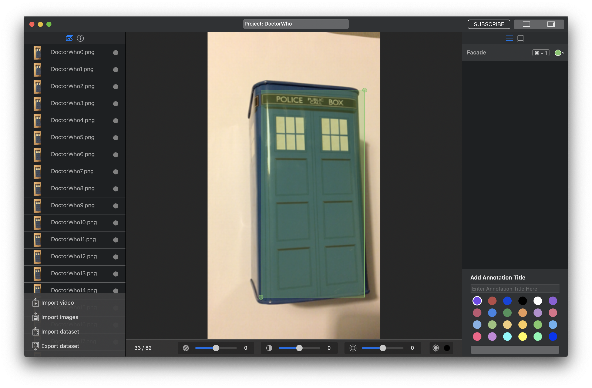
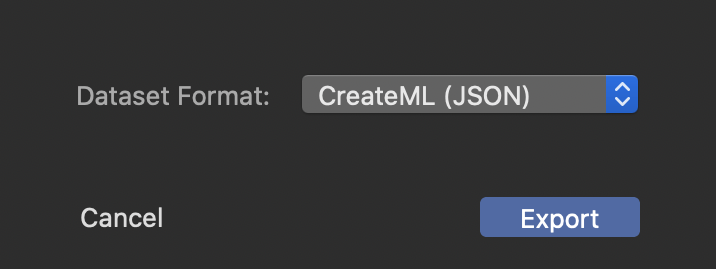
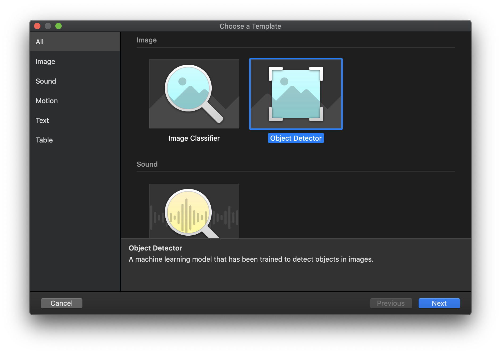
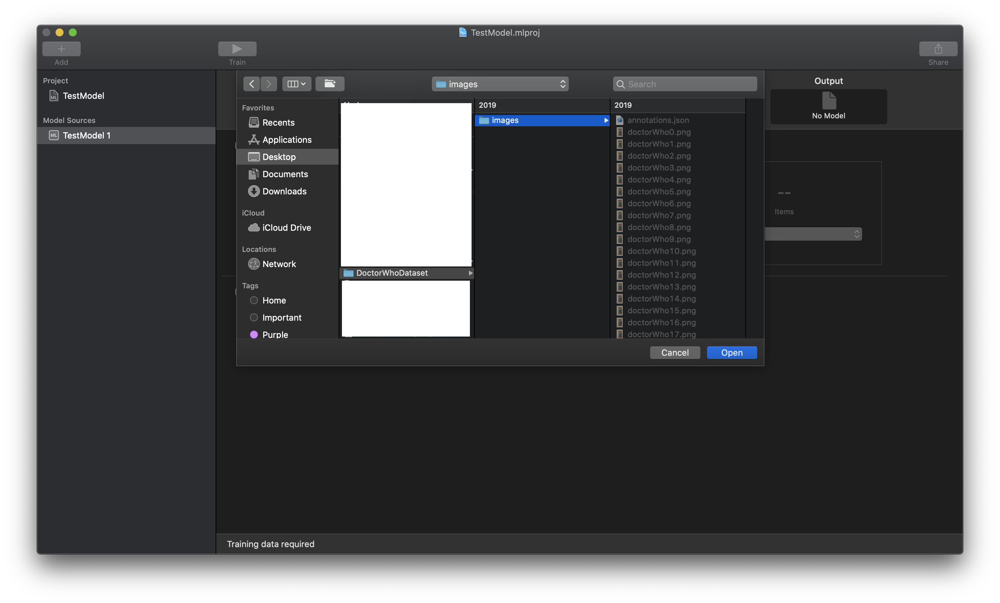

#  Test  Your  Model  
  
Test  Your  Model  est une application qui permet d’exploiter des modèles  **Core  ML**. Dans le cadre de la détection d’objet  
  
#  Objectif  
  
L’objetif de Test  Your  Model  est de tester les modèles directement depuis une  url.  
  
#  Utilisation  
  
1. Télécharger le projet puis ajouter votre modèle  **Core  ML**  
2. Dans  ObjectDetectorViewController.swift  modifié  la propriété  **modelName**  avec le nom de votre modèle.  
3. Lancer l'application sélectionnée  **Object  Detector**  vous aurez le choix entre  **Photo**  ou  **Live**  
  
##  Création de modèle  
  
La création nécessite une carte graphique.  
  
###  Logiciel  
-  Make  ML  ( optionnelle  )  
-  Create  ML  
-  Xcode  >=  11  
  
###  Conception  
  
- Prendre des photos de l’objet au minimum une dizaine et sous plusieurs angles, luminosité et surface pour optimiser l’apprentissage  
-  Make  ML  
	- Importer les photos  
	- Ajouter un titre d'annotation avec le nom de l'objet *(  ex: voiture  rouge )* ce nom seras le nom de l’objet dans le modèle 
	- Pour chaque photo  importer  sélectionner l’objet avec l'outil de sélection  
	
	

	- Après la sélection de toutes les images exporter le  dataset  avec le format  ***CreateML  (JSON)***  

	

- Create ML
	- Sélectionner ***Object Detector***

	

	- Dans ***Training Data*** sélectionner le CataSet exporter pars MakeML

	

	- Cliquer sur Train
  
##  Photo  
  
##  Live

---
### Inspiration
https://developer.apple.com/documentation/vision/recognizing_objects_in_live_capture